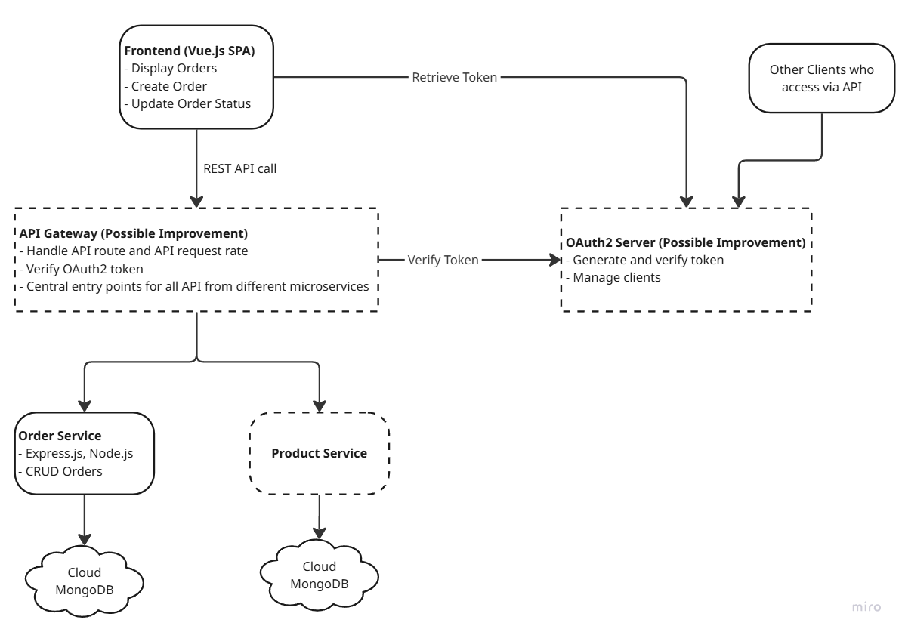

# Backend

## Installation

Install backend dependencies with npm

```bash
  cd ./backend
  npm i
```

## Startup

Does not need to setup .env, commit into git since it is assessment.

```bash
  npm run dev
```

## Tech Stack

| Stacks           | Reason                                                                                                     |
| ---------------- | ---------------------------------------------------------------------------------------------------------- |
| Express.js, Jest | As recommended by the assessment. Its new tech stack to myself, and would like to explore it.              |
| MongoDB          | It has a free version on cloud, we not required local install and startup, it is easier for project setup. |

# Frontend

## Installation

```bash
  cd ./frontend
  npm i
```

## Startup

Does not need to setup .env, commit into git since it is assessment.

```bash
  npm run dev
```

## Tech Stack

| Stacks       | Reason                                       |
| ------------ | -------------------------------------------- |
| PrimeVue V4  | Complete UI components ready-to-use          |
| Tailwind CSS | Reusability, Consistent and less custom code |

## Architecture Overview



## Approach to scalability and potential improvements

- To separate products and orders into different microservices with its own database.
- Use API gateway for load balancing, distributing API requests across microservices, API logs and etc.
- An OAuth2 server to handle authorization for different clients.
- Apply caching(Redis) method in frontend and microservices for frequent access data, i.e. order list, product general info.

## Assumptions Made During Development

- A very early stage of order microservice in an ERP system. It handles order's basic CRUD.
- A microservice handles Product's CRUD.
- Communication between microservices occurs within a secure internal network.
- Order Data Volume Is Manageable.

## AI Usage Log

- API Prompt where mainly focus in getting overall idea and generating boilerplate of the project using [ChatGpt](https://chatgpt.com/share/68ec5e1c-f2b8-800b-9288-82415e8d28ca).

```
Your Role: You are a Senior Full Stack Developer that implementing highly reusable component's web application, high quality backend program and clear documentation.

Stacks: Vue 3, Express.js, Typescript Plan for the work ahead and write your steps.

Requirements: Frontend (Vue.js):
- Build a single-page dashboard using Vue 3
- Display a list of production orders with columns: Order ID, Product Name, ...
```

## How this feature aligns with SuDu AI’s goal

Integrating OAuth2 and Redis caching helps SuDu AI automate 80% of routine operations by enabling secure, seamless access and faster data processing. These features reduce manual management, improve system speed and reliability, and ensure the platform runs efficiently with minimal human intervention.
